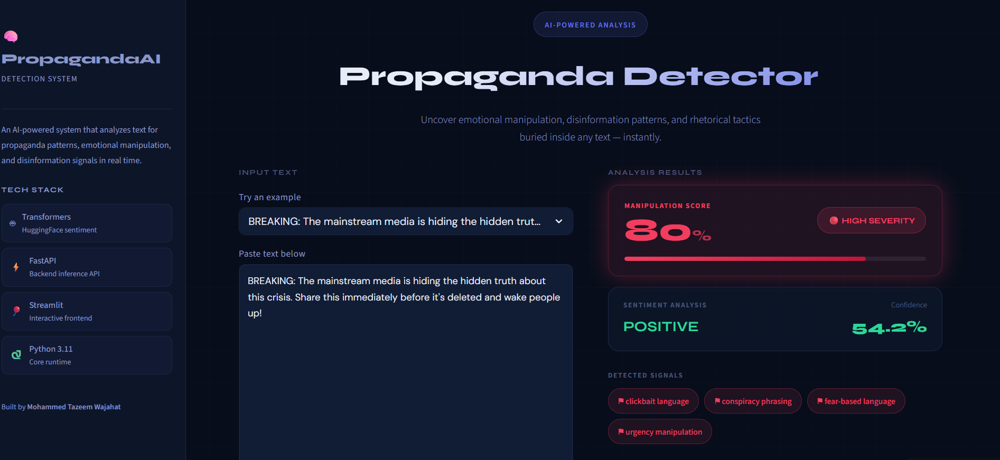

# 📰 AI Propaganda Detector

An AI-powered full-stack web application that analyzes text for propaganda patterns, emotional manipulation, conspiracy framing, urgency tactics, and sensationalized language.

Built using FastAPI, Streamlit, HuggingFace inference APIs, and a custom weighted heuristic scoring engine.

---

# 🌐 Live Demo

### Frontend
https://propaganda-detector-using-ai-tazeem.streamlit.app/

### Backend API
https://propaganda-detector-using-ai-1.onrender.com/

---

# ⚡ Features

- Clickbait language detection
- Fear-based narrative detection
- Conspiracy phrasing analysis
- Urgency manipulation detection
- Emotional intensity scoring
- Severity classification (LOW / MEDIUM / HIGH)
- Duplicate phrase suppression
- Real-time transformer-based sentiment analysis
- Cloud deployment with separate frontend/backend architecture
- Environment-based configuration management

---



# 🧠 How It Works

The system combines:
- Transformer-based sentiment analysis
- Rule-based NLP heuristics
- Weighted scoring architecture
- Custom manipulation signal detection

Each detected pattern contributes to a weighted manipulation score, which is then classified into:
- LOW
- MEDIUM
- HIGH

severity levels.

---

# 🏗️ System Architecture

```text
User Input
    ↓
Streamlit Frontend
    ↓
FastAPI Backend
    ↓
HuggingFace Inference API
    ↓
Custom Scoring Engine
    ↓
Severity Classification
    ↓
Frontend Visualization
```

---

# 📊 Example Analysis

## Input

```text
BREAKING! The mainstream media is hiding the hidden truth. Act now before this gets deleted!
```

## Output

- Manipulation Score: 92%
- Severity: HIGH

### Flags Detected
- clickbait language
- conspiracy phrasing
- urgency manipulation
- high emotional intensity

---

# 🛠️ Tech Stack

## Frontend
- Streamlit

## Backend
- FastAPI
- Python

## AI / NLP
- HuggingFace Inference API
- DistilBERT Sentiment Model

## Deployment
- Streamlit Cloud
- Render

---

# 🚀 Running Locally

## 1. Clone the repository

```bash
git clone https://github.com/richrebellion7/propaganda-detector-using-ai.git
```

## 2. Install dependencies

```bash
pip install -r requirements.txt
```

## 3. Create a `.env` file

```env
HF_TOKEN=your_huggingface_token
BACKEND_URL=http://127.0.0.1:8000/analyze
```

## 4. Start backend server

```bash
uvicorn main:app --reload
```

## 5. Start frontend

```bash
streamlit run frontend.py
```

---

# 🔮 Future Improvements

- OCR-based image propaganda detection
- News article URL analysis
- Chrome extension integration
- Semantic phrase matching
- User authentication system
- Saved analysis history
- Multi-model propaganda classification
- Dashboard analytics
- Real-time social media scanning

---

# 👨‍💻 Built By

### Mohammed Tazeem Wajahat

Computer Science Engineering student focused on AI/ML systems, NLP applications, and full-stack AI product development.